# Arquitetura

## Camadas

- `app/routers`: entrada HTTP, validacao leve e renderizacao de templates.
- `app/services`: casos de uso, consultas coordenadas e transacoes.
- `app/domain`: regras puras de classificacao, bracket, pontuacao e snapshots.
- `app/repositories`: consultas persistentes compartilhadas quando reduzem duplicacao.
- `app/cli`: comandos operacionais para seed, sync e recompute.
- `app/templates`: Jinja com logica minima.
- `app/static`: CSS e JavaScript reduzidos ao necessario.

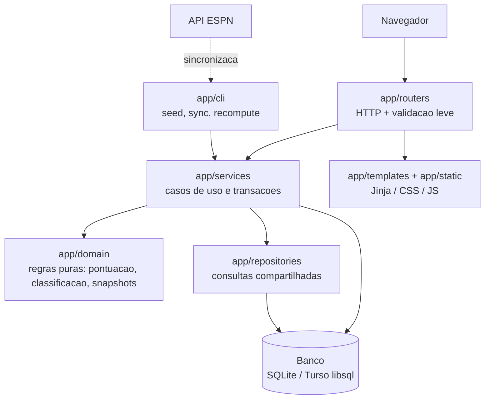

## Fonte de verdade da pontuacao

`app/domain/pontuacao.py` define pesos, ordenacao, desempates e serializacao de snapshots. `app/services/ranking.py` converte dados persistidos para essa regra. Ranking, comparativos, live e recompute consomem o mesmo servico.

## Banco

O alvo preserva SQLModel, SQLite local e Turso/libsql. Dados sensiveis ficam fora do Git e sao configurados por `.env`.

## Modelagem de dados

Todas as tabelas sao definidas em `app/models.py` com SQLModel. Nao ha um unico agregado central: `User`, `Team` e `Match` sao as entidades base, e cada tipo de palpite tem sua propria tabela normalizada.

### Entidades base

#### `User` (`users`)

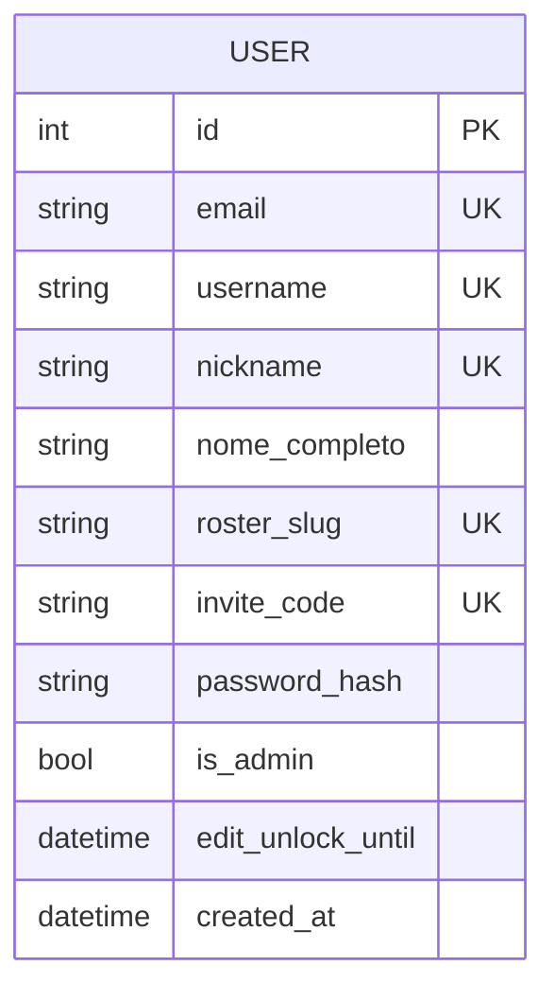

Participante do bolao. `nickname` e o identificador publico (usado em URLs de palpite/comparacao). `email`, `username`, `roster_slug` e `invite_code` sao opcionais, suportando os diferentes fluxos de onboarding. `edit_unlock_until` reabre a edicao de palpites apos o fechamento geral para um usuario especifico.

#### `Team` (`teams`)

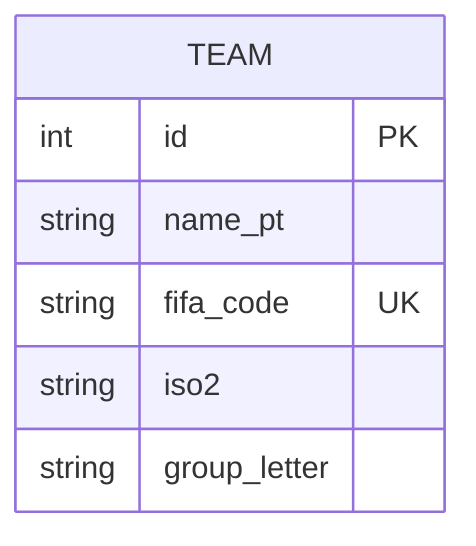

Selecao da Copa. `fifa_code` e a chave natural usada para casar com a API da ESPN durante a sincronizacao; `group_letter` associa o time a um grupo (A-H).

#### `Match` (`matches`)

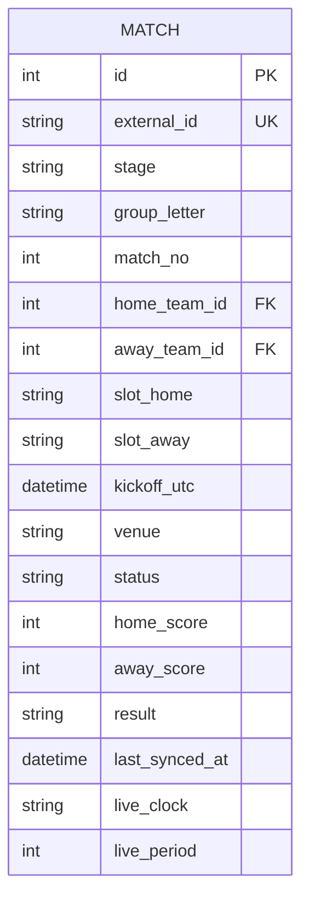

Partida, tanto de grupo quanto de mata-mata. `stage` distingue `GROUP` de `R32`, `R16`, `QF`, `SF`, `F` e `CHAMPION`; `group_letter`/`match_no` so fazem sentido na fase de grupos. `home_team_id`/`away_team_id` ficam nulos antes da definicao do chaveamento, por isso `slot_home`/`slot_away` guardam o placeholder textual (ex.: "1o Grupo A"). `external_id` e a chave de casamento com a ESPN. `status`, `*_score`, `result` e `live_*` sao atualizados por `app/services/sincronizacao.py`.

### Palpites (uma tabela por tipo de aposta)

Cada fase do bolao tem regra de pontuacao propria (`app/domain/pontuacao.py`) e granularidade diferente: grupo e por jogo, desempate e por grupo inteiro, terceiros e global, mata-mata e por fase ou por confronto. Por isso cada tipo de palpite vive em sua propria tabela.

#### `BetGroup` (`bets_group`)

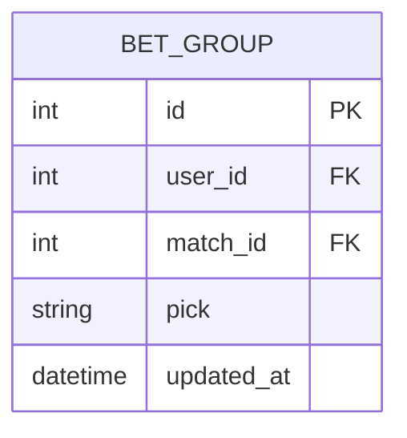

Palpite de resultado (`pick` em `HOME`/`DRAW`/`AWAY`) para um jogo de grupo. Unicidade composta em `(user_id, match_id)`.

#### `BetTieBreak` (`bets_tie_break`)

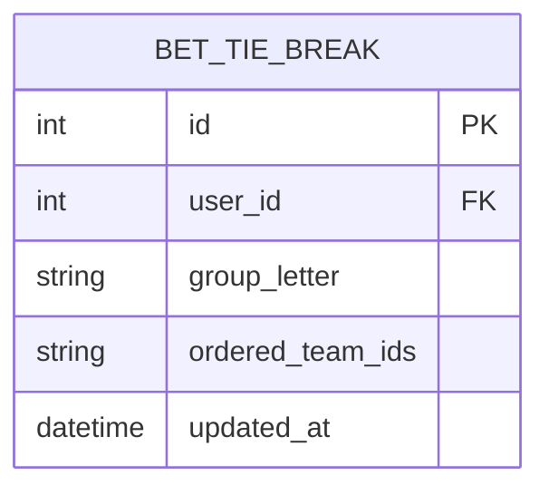

Desempate de classificacao dentro de um grupo; `ordered_team_ids` guarda a ordem completa dos times do grupo serializada como string. Unicidade composta em `(user_id, group_letter)`.

#### `BetThirdsOrder` (`bets_thirds_order`)

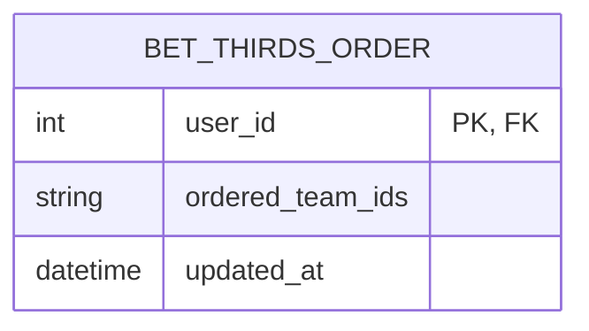

Ordenacao dos melhores terceiros colocados entre todos os grupos. A chave primaria e o proprio `user_id` (um registro por usuario, nao por grupo).

#### `BetKnockout` (`bets_knockout`)

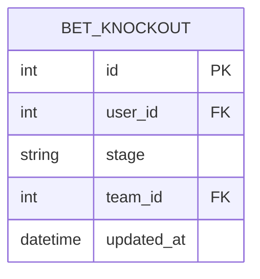

Palpite de quais times avancam em uma fase de mata-mata. Unicidade composta em `(user_id, stage, team_id)` - o conjunto de linhas com o mesmo `(user_id, stage)` representa os classificados escolhidos para aquela fase.

#### `BetMatch` (`bets_match`)

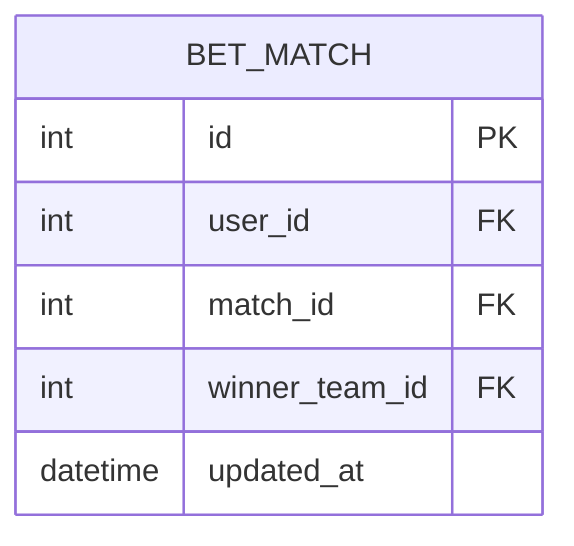

Palpite de vencedor de um confronto de mata-mata ja definido. Unicidade composta em `(user_id, match_id)`.

### Historico e configuracao

#### `LeaderboardSnapshot` (`leaderboard_snapshots`)

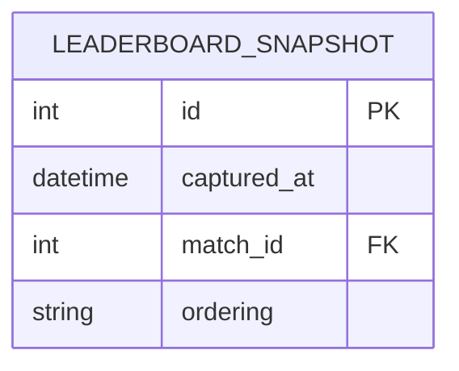

Foto do ranking em um instante, tirada a cada jogo processado (`match_id` aponta para o jogo que disparou a atualizacao). `ordering` serializa posicoes e pontuacao de todos os usuarios naquele momento (`serialize_snapshot_ordering`/`parse_snapshot` em `app/services/ranking.py`), permitindo montar o grafico de evolucao do ranking sem recalcular tudo a cada leitura.

#### `Setting` (`settings`)

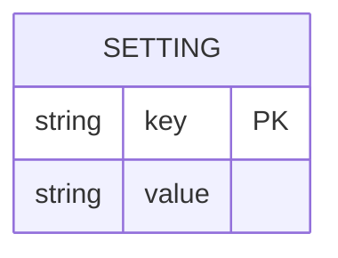

Tabela chave-valor generica para configuracao operacional persistida (ex.: flags de estado do workflow), separada das variaveis de `.env`.

### Relacionamentos

Visao geral de como as entidades acima se conectam (campos completos de cada uma estao nos diagramas por entidade anteriores):

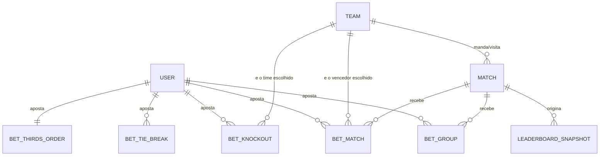

Nao ha cascade delete configurado: a integridade entre `users`/`teams`/`matches` e as tabelas de aposta e responsabilidade da camada de servico (`app/services/palpites.py`), que sempre escreve/atualiza pelo par de chaves unico em vez de duplicar linhas.

